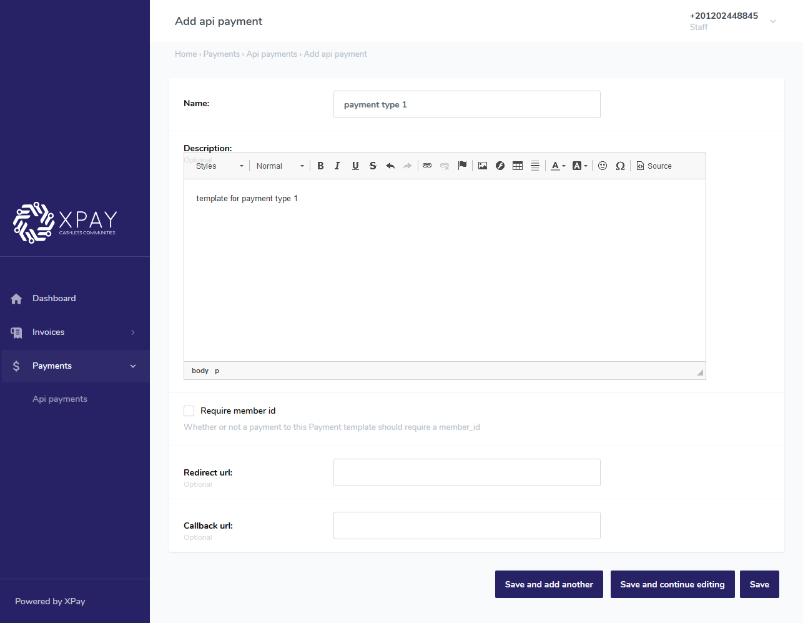
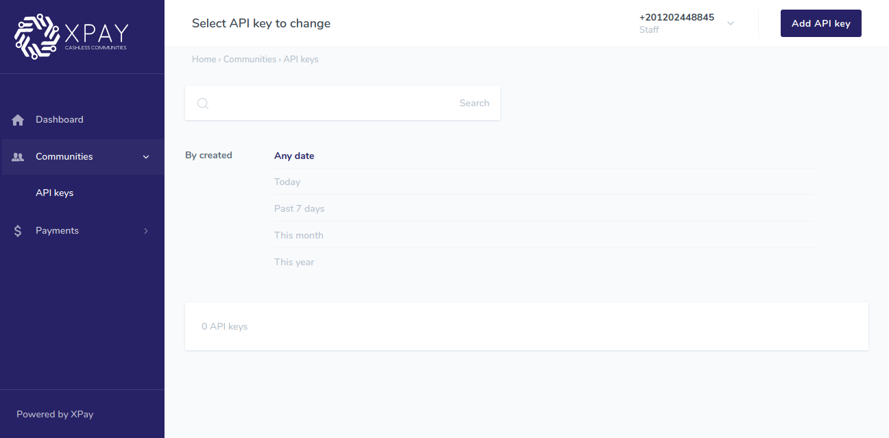
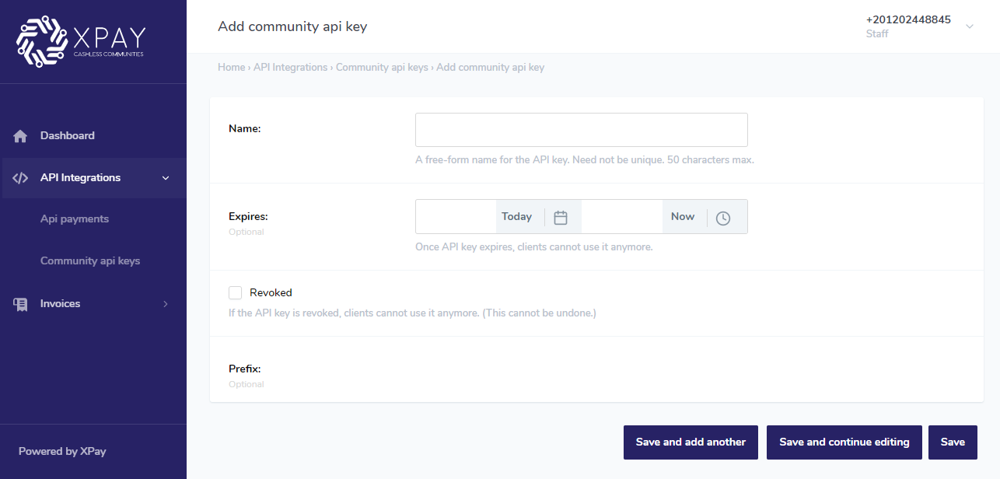
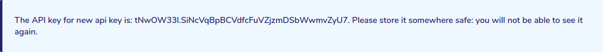

# 1. prepare amount

  

Note: depending on the agreement with XPay, if the service fees are **included in bill**, skip this step.

  

# Description

  

this endpoint takes an amount in **piasters**  `<amount_piasters>` and a community id `<community_id>`,

  

and calculates the service fees added to the amount.

  

-  ## URL

	if you are on testing server:

		https://staging.xpay.app/api/payments/prepare-amount/

	if you are on production server(Live):

		https://community.xpay.app/api/payments/prepare-amount/

  

-  ## Method

  

		POST

  
  

-  ## Body Params

		{ "amount_piasters": 100, "community_id": 1}

  

Notes:

  

-  `<community_id>`, is an ID that references prefrences to your community, it must always be present and of value that your community recieved from XPay.

  

-  `<amount_piasters>`, is the amount that represents the service cost without service fees and must be entered in **piasters**(integer).

  
  

-  ## Response body

  

If the POST request was successful, it will return `<totaL_amount_piasters>` which is the service cost with service fees included, save the value returned in `<total_amount_piasters>` as you will use it later.

  
	{
		"status": {
			"code": 200,
			"message": "success",
			"errors": []
		},

		"data": {
			"total_amount_piasters": 101
		},
		"count": null,
		"next": null,
		"previous": null
	}
		  
  

# 2. API Payment
  

1. Navigate to XPay community admin dashboard and login with the url and credentials that your community recieved later.

  

2. Navigate to **API Payment** under **API Integrations** section in the side menu.

  


  
  

3. Click on **add variable amount** button in the top right corner.



  

4. Fill in the name and description that describe your payment type.

  

5. check **Is active** option.

  

6. if you want your payments to require a `<member_id>` field, check  ** Require member id**, this id will not be validated, it will just be an internal info in your business, if you don't need it.. uncheck it.

7. if you want the payment iframe to redirect to a specific page after payment is done,  fill in the url to redirect to in ** Redirect url** field. In the redirected url you will have the status of the transaction, the transaction id, and the member id if provided.

9. If you want the payment server to send a POST request to another server with transaction status, and details, after payment is done,  fill in ** Callback url** field. The POST request body will have the status of the transaction, the transaction id, and the member id if provided.

10. click **Save**.


  

9. you will be redirected back to **API Payment**, the new created template will appear.

  

10. save the value in the **ID** column for later.

  


  
  
  

# 3. API key

1. Navigate to **Community api keys** under **API Integrations** in the side menu.

  



  

2. Click on **add API key** button in the top right corner.

  

3. Fill in the name.



  
  

4. click **Save**, you will be redirected back to **API keys**.

  

5. copy the api key value from the message that appears in the top and save it safely as it can't be retrieved later.

  



  
  
  

# 4. pay endpoint

  

# Description

This endpoint will take required payment info and pass them to our Core Payment API and return the resultant response.

  

<!-- After the payment cycle ends, the user will be redirected to the url filled while creating the API Payment and will return member id and transaction id as query paramaters. -->

  

-  ## URL

	if you are on testing server:

		https://staging.xpay.app/api/payments/pay/variable-amount

	if you are on production server(Live):
	
		https://community.xpay.app/api/payments/pay/variable-amount
  

​

  

-  ## Method

  

		POST

  

​

  

-  ## Header Params

  

		x-api-key : <api-key>

​
Note: replace `<api-key>` with the api key you generated in [the third step](#3-api-key)


there are three payment options available at the moment; card, cash collection and kiosk (aman / masary)  

​to use payment using card option, you supply the request with this payload:
  

-  ## Body Params
		{
			"billing_data": {
				"name": "Islam Rostom",
				"email": "islam.rostom93@gmail.com",
				"phone_number": "+201119045759"
			},
			"amount_piasters": 5000,
			"variable_amount_id": 4,
			"community_id": 1,
			"pay_using": "card"
		}

to use payment using card option, you supply the request with this payload:
  

-  ## Body Params
		{
			"billing_data": {
				"name": "Islam Rostom",
				"email": "islam.rostom93@gmail.com",
				"phone_number": "+201119045759"
			},
			"amount_piasters": 5000,
			"variable_amount_id": 4,
			"community_id": 1,
			"pay_using": "kiosk"
		}


​to use payment using cash collection option, you supply the request with this payload:
- ## Body Params
		{
			"billing_data": {
				"name":"Islam Rostom",
				"email":"islam.rostom93@gmail.com",
				"phone_number":"+201119045759",
				"country":"EG",
				"state":"Al Meniya",
				"city":"Mghagha",
				"street":"street name",
				"building":"5",
				"apartment":"5",
				"floor":"5"
				},
				"amount_piasters":5000,
				"variable_amount_id": 4,
				"community_id":1,
				"pay_using":"cash"
		}
  
  
  

Notes:

 - for the pay using cash option, you will find all state-city combinations in this [JSON file](state-city.json). 
  

-  `<amount_piasters>`, is the amount that will be debited from your community's member in **piasters**, if your community fees is included in bill then use the value returned from [prepare amount step](#1-prepare-amount) , otherwise use the amount you want to charge the member directly in **piasters**.

  

- The `<name>` field's value must contain first and last name in **english letters** with space between them.

  

-  `<phone_number>` field's value **must contain country code** prefixed

  

-  `<variable_amount_id>`, is an ID that references to the API Payment you created in [API Payment step](#2-variable-amount-template).

  

-  `<community_id>`, is an ID that references prefrences to your community, it must always be present and of value that your community recieved.

  
  
  
  
  

-  ## Response body

If the POST request was successful, it will return an iframe url along with the transactionn id like in this example that the user can proceed with the payment process at.

- Response for payment using card option:

		{
			"status": {
				"code": 200,
				"message": "success",
				"errors": []
			},
			"data": {
				"iframe_url": "https://dev-payment.xpay.app/core/payment_iframe/2733/",
				transaction_id: 3220,
				transaction_status: "SUCCESSFUL",
				transaction_uuid: "94fdb93f-c7f0-4b4d-8c8f-1c463c931344"
			},
			"count": null,
			"next": null,
			"previous": null
		}


- Response for payment using kiosk option:
```
{
	"status": {
		"code": 200,
		"message": "success",
		"errors": []
	},
	"data": {
		"iframe_url": null,
		transaction_id: 3220,
		transaction_status: "PENDING",
		transaction_uuid: "94fdb93f-c7f0-4b4d-8c8f-1c463c931344"
		message: "Go to the nearest kiosk that has Masary/Aman payment machines and ask the seller to pay for(Madfouaat Mutanouea Accept مدفوعات متنوعة اكسبت) and give them that number 4424",
			"bill_reference": 4424
	},
	"count": null,
	"next": null,
	"previous": null
}
```


- Response for payment using cash collection option:
```
{
	"status": {
		"code":200,
		"message":"success",
		"errors":[]
	},
	"data": {
		"iframe_url":null,
		"transaction_id":3273,
		"transaction_status":"PENDING",
		"transaction_uuid":"411889e5-fc8f-4db3-810d-c1beddb5a2a4",
		"message":"Our representative will go to the address you provided to collect the cash from you"
	},
	"count":null,
	"next":null,
	"previous":null
}
```

# 6. Transactions endpoint
## Description 

this endpoint takes an amount in `<transaction_uuid>` and a community id `<community_id>` and returns transaction info.

After getting a response from Pay endpoint you can use this endpoint to fetch informations about the transaction such as status, transaction id , total amount paid, ETC...
  

## REQUEST

### testing server:

`GET https://staging.xpay.app/api/communities/{community_id}/transactions/{transaction_uuid}/`

### production(Live) server:

`GET https://community.xpay.app/api/communities/{community_id}/transactions/{transaction_uuid}/`


## Parameters
### Path parameters

`community_id`


an ID that references prefrences to your community, it must always be present and of value that your community recieved from XPay.

`transaction_uuid`

UUID of the transaction to be fetched, you usually have this value from the response of PAY endpoint.

## Request body

	Do not supply a request body.
  
## Response body
If successful, this method returns a response body with the following structure example:

```
{
	"status": {
		"code": 200,
		"message": "success",
		"errors": []
	},
	"data": {
		"created": "2020-05-10T14:20:11.855539+02:00",
		"id": 3517,
		"uuid": "452ecb4d-3b6e-4a94-af82-f3ffd21c7e0f",
		"member_id": null,
		"total_amount_piasters": 5000,
		"payment_for": "VARIABLE_AMOUNT",
		"quantity": null,
		"status": "SUCCESSFUL",
		"community": {
			"id": 1,
			"name": "Test Community 1",
			"logo": "https://staging-cdn.xpay.app/community/logo/Alexandria_Sporting_Club_logo.png",
			"app_modules_to_see": [
				"Academy",
				"Event",
				"Bill",
				"Service"
			],
			"payment_methods": [
				"Card",
				"Kiosk",
				"Cash"
			],
			"address": null,
			"login_process": "OTP_MEMBER_ID",
			"cc_fees_piasters": 5000
		}
	},
	"count": null,
	"next": null,
	"previous": null
}
```

# 5. Invoices

XPay dashboard also provides you with invoices of each payment made to your community, navigate to API Payment Invoices, in invoices section, you will see there the status of every payment, it's transaction id, and other payment and customer details.

  
