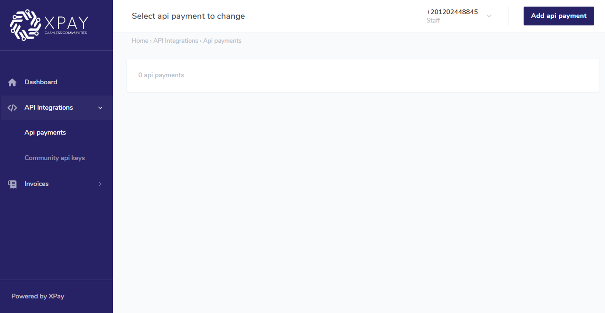
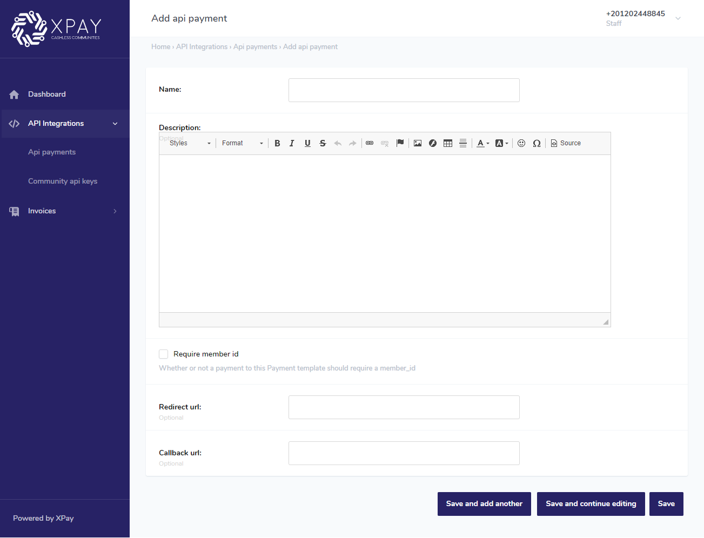
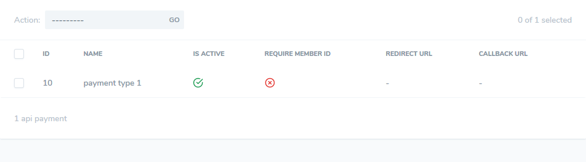

this section explains how to use the dashboard to create an API Payment that you need to process payments on your app using our API endpoints.

1. Navigate to XPay community admin dashboard and login with the url and credentials that your community recieved later.

2) Navigate to **API Payment** under **API Integrations** section in the side menu.

3. Click on **add variable amount** button in the top right corner.

4. Fill in the name and description that describe your payment type.

5) check **Is active** option.

6. if you want your payments to require a `<member_id>` field, check ** Require member id**, this id will not be validated, it will just be an internal info in your business, if you don't need it.. uncheck it.

7. if you want the payment iframe to redirect to a specific page after payment is done, fill in the url to redirect to in ** Redirect url** field. In the redirected url you will have the status of the transaction, the transaction id, and the member id if provided.

8. If you want the payment server to send a POST request to another server with transaction status, and details, after payment is done, fill in ** Callback url** field. The POST request body will have the status of the transaction, the transaction id, and the member id if provided.

9. click **Save**.

9) you will be redirected back to **API Payment**, the new created template will appear.

10. save the value in the **ID** column for later.

